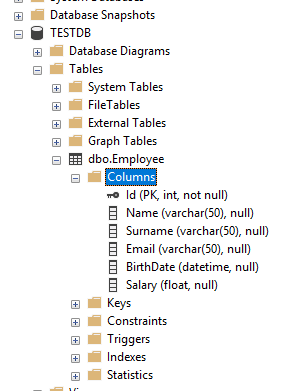

# Overview

The purpose of this library is the **CRUD** operations on the mssql server and also to work with a clean architecture. This library was developed with .NET standard.

# Installation
[Nuget Package](https://www.nuget.org/packages/TStack.ADO/)
#### Package Manager
```PM
Install-Package TStack.ADO -Version 1.0.0
```
#### .NET CLI
```PM
dotnet add package TStack.ADO --version 1.0.0
```
#### PackageReference
```PM
<PackageReference Include="TStack.ADO" Version="1.0.0" />
```
#### Paket CLI
```PM
paket add TStack.ADO --version 1.0.0
```

# Usage
Before usage test project create manually database table like on picture 



### Step One
Inherit the ADOConnection class to the new class you are creating and set up the database connection.

```csharp
  public class TestConnection : ADOConnection
    {
        public TestConnection() : base(@"Server=.\SQLEXPRESS;Database=TESTDB;Trusted_Connection=True;")
        {
        }
    }
```

### Step Two
ADOManager is an abstract class, so it must be inherited to your new class, in which case all methods can be used
```csharp
 public class SQLManager : ADOManager
    {
        public SQLManager(TestConnection connection) : base(connection)
        {
        }
    }
```
That's it, ready to use.

## Library Fundamentals
For use methods first learn what is parameters and features, lets look.
#### Query
This parameter is the reference type **string**, if the entered query is **stored procedure**, the [CommandType](#commandtype) parameter should be selected as "StoredProcedure", otherwise "Text"
#### CommandType
This parameter is the reference type enum and have two choice
 - Text
 - StoredProcedure
 
#### Parameter
This parameter is reference type List of Parameter class and for usage has two parameter "key" (string,not nullable), "value" (object, not nullable)
Example Usage :
```csharp
 List<Parameter> parameters = new List<Parameter>();
 parameters.Add("Name", "Ferhat");
```
**Note :** The @ character is not required in the entered key parameter. No problem if entered.
```
parameters.Add("Name", "Ferhat");  Allowed
parameters.Add("@Name", "Ferhat"); Allowed
```
## Methods

### ExecuteScalar
This function returns a generic variable type, the typed query contains a single row and must contain a single column.

```csharp
int response = _adomanager.ExecuteScalar<int>("SELECT count(*) from companies",CommandType.Text,null);
```
### Execute
This function has no return type. Runs a typed query.
```csharp
_adomanager.Execute("TRUNCATE TABLE companies",CommandType.Text,null);
```

### GetDataTable
This function returns datatable, Runs a typed query, but must contains single query.
```csharp
DataTable datatable = _adomanager.GetDataTable("SELECT * FROM companies",CommandType.Text,null);
```
### GetDataSet
This function returns dataset, Runs a typed queries, contains can multiple queries.
```csharp
DataSet dataset = _adomanager.GetDataTable(@"
SELECT * FROM companies;
SELECT * FROM employees;
",CommandType.Text,null);
```
# Author

Ferhat Candaş - Software Developer
 - Mail : candasferhat61@gmail.com
 - LinkedIn : https://www.linkedin.com/in/ferhatcandas
